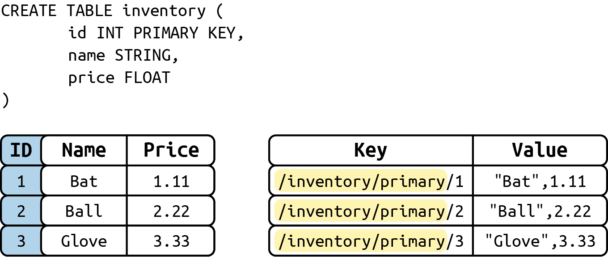
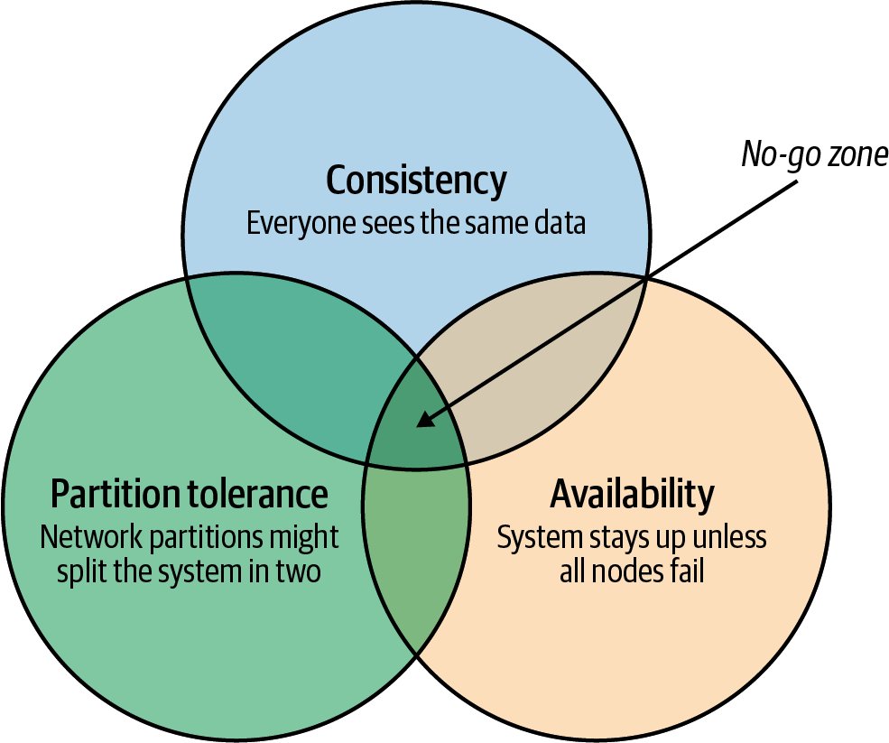
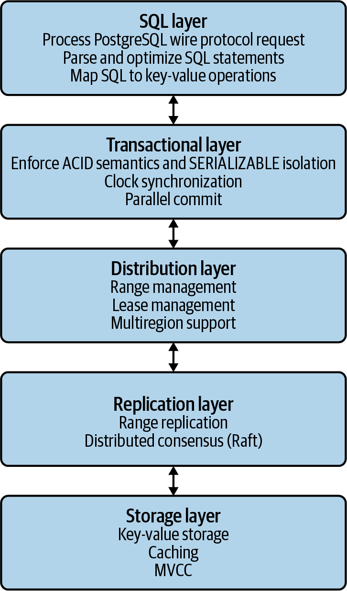
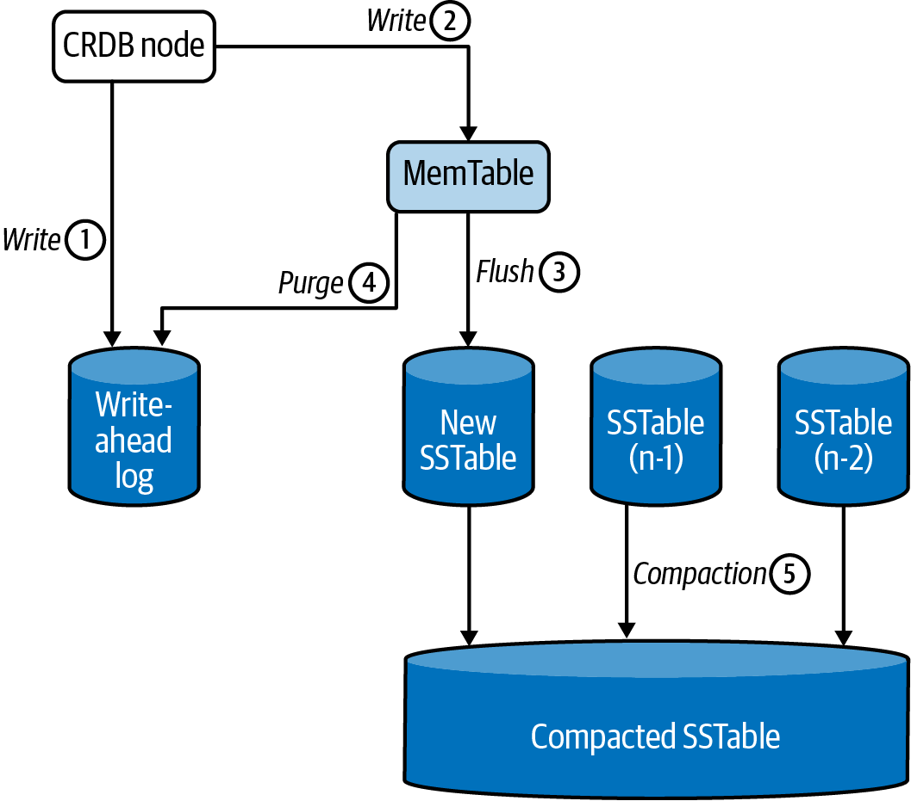
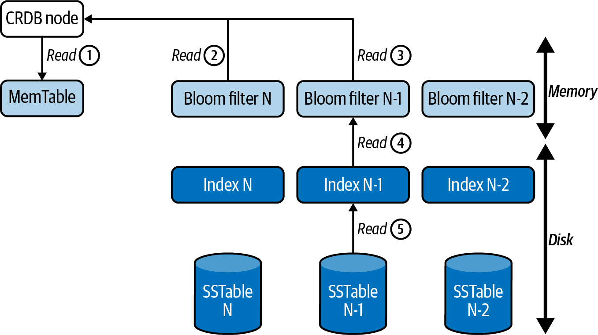

# CockroachDB

## CockroachDB overview

CockroachDB is basically a `key-value` store.

<p float="left">
    
</p>

* CockroachDB prioritizes `consistency` over `availability`.
* CockroachDB prioritizes `transactional` workloads over `analytic` workloads.

<p float="left">
    
</p>

* `Scalability`: The CockroachDB distributed architecture allows a cluster to scale seamlessly as workload increases or decreases.
* `High availability`: CockroachDB can continue operating if a node, zone, or region fails without compromising availability.
* `Consistency`: CockroachDB provides the highest practical level of transactional isolation and consistency.
* `Performance`: The CockroachDB architecture is designed to support low-latency and high-throughput transactional workloads.
* `Geo-partitioning`: CockroachDB allows data to be physically located in specific localities to enhance performance for localized applications and to respect data sovereignty requirements.
* `Compatibility`: CockroachDB implements ANSI-standard SQL and is wire-protocol compatible with PostgreSQL.
* `Portability`: The CockroachDB architecture is very well aligned with containerized deployment options, and in particular, with Kubernetes. 

## CockroachDB architecture

<p float="left">
    
</p>

* The `SQL layer` accepts SQL requests in the PostgreSQL wire protocol. It parses and optimizes the SQL requests and translates the requests into KV operations that can be processed by lower layers.
* The `transaction layer` is responsible for ensuring ACID transactions and serializable isolation. It ensures that transactions see a consistent view of data and that modifications occur as if they had been executed one at a time.
* The `distribution layer` is responsible for the partitioning of data into ranges and the distribution of those ranges across the cluster. It is responsible for managing range leases and assigning leaseholders.
* The `replication layer` ensures that data is correctly replicated across the cluster to allow high availability in the event of a node failure.
* The `storage layer` is responsible for the persistence of data to local disk and the processing of low-level queries and updates on that data.

<p float="left">
    
    
</p>

## CockroachDB installation

1. Download the binaries from [the releases](https://www.cockroachlabs.com/docs/releases/index.htm). 

2. Unzip and move the binaries to `/usr/local/bin`:
```bash
tar zxvf cockroach-v22.1.0.darwin-10.9-amd64.tgz
cp -r cockroach-v22.1.0.darwin-10.9-amd64/* /usr/local/bin
```

3. Start a temporary, in-memory CockroachDB cluster of 1 node: 
```bash
cockroach demo
```

4. Start a persistent, insecure CockroachDB cluster of 1 node: 
```bash
cockroach start-single-node --insecure --listen-addr=localhost
```

5. Connect to the CockroachDB cluster from a client:
```bash
cockroach sql --insecure
```

6. Generate some dummy key-value data:
```bash
cockroach workload init kv
cockroach workload run kv --duration 10s
```

7. Show the dummy key-value data:
```sql
> show databases;
  database_name | owner | primary_region | regions | survival_goal
----------------+-------+----------------+---------+----------------
  defaultdb     | root  | NULL           | {}      | NULL
  kv            | root  | NULL           | {}      | NULL
  postgres      | root  | NULL           | {}      | NULL
  system        | node  | NULL           | {}      | NULL
  
> use kv;
> show tables;
    schema_name | table_name | type  | owner | estimated_row_count | locality
--------------+------------+-------+-------+---------------------+-----------
  public      | kv         | table | root  |                3217 | NULL

> select * from kv limit 5;
           k           |  v
-----------------------+-------
  -9210704934152406691 | \x87
  -9203392377336618164 | \xf2
  -9202077040322140143 | \xe5
  -9199073458229546255 | f
  -9187217482832003982 | i
```
